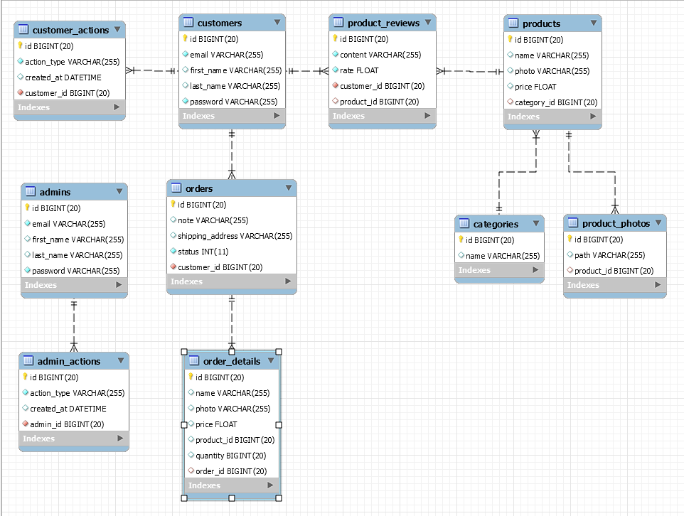

# Dokumentacija

## Opis projekta

Projekat realizuje osnovne bekend funkcionalnosti REST API aplikacije za veb prodavnicu. Neke od mogućnosti su logovanje korisnika i administratora, CRUD akcije nad proizvodima, kategorijama, recenzijama, narudzbenicama, itd...

## Funkcionalnosti po tipu korisnika

### Neautorizovani korisnik

- Registracija kao kupac

- Login kao kupac

- Login kao admin

- Prikaz proizvoda

- Prikaz revizija proizvoda

- Prikaz kategorija

### Kupac

- Ažuriranje ličnih podataka

- Prikaz izvršenih akcija u sistemu

- Pravljenje nove porudžbenice

- Prikaz ličnih porudžbenica

- Otkazivanje ličnih porudžbenica

- Dodavanje revizije proizvoda

- Ažuriranje revizije proizvoda

- Brisanje revizije proizvoda

### Admin

- CRUD nad proizvodima

- CRUD nad kategorijama

- Prikaz svih porudžbenica

- Slanje porudžbenica

- Prikaz izvršenih akcija u sistemu

## Korišćene tehnologije

- Java 11
- Spring Boot
- MySQL
- Hibernate JPA ORM
- Querydsl
- Lombok
- ModelMapper
- Spring Security
- JSON Web Token (JWT)
- Swagger API Docs

## Dizajn baze podataka

Za čuvanje podataka koršćena je MySQL baza podataka, sa sledećom strukturom:

## Arhitektura projekta

Aplikacija je rasporedjena po java paketima od kojih svaki predstavlja jedan sloj u celokupnoj arhitekturi aplikacije.

### Domain

Domenski sloj aplikacije predstavlja skup klasa koje opisuju strukturu, i medjusobne relacije domenskih podataka naše aplikacije.

https://github.com/markorusic/spring-boot-webstore/tree/master/src/main/java/com/markorusic/webstore/domain

### DAO

DAO, odnosno Data Access Object, je sloj koji se bavi komunikacijom naše aplikacije sa bazom podataka. Struktura podataka, i relacije baze opisani su u domenskom sloju, tako da se Dao sloj oslanja na njega. Upotrebom domenskog sloja i JPA interfejsa, odnosno Hibernate ORM implementacije dobijamo DAO sloj.

https://github.com/markorusic/spring-boot-webstore/tree/master/src/main/java/com/markorusic/webstore/dao

### Service

Servisni sloj predstavlja skup interfejsa koji opisuju biznis logiku naše aplikacije. Za svaki definisani interfejst pravimo klasu koja predstavlja stvarnu implementaciju, i u kojoj živi celokupna lokiga. Servisni sloj, odnosno njegova implementacija se oslanja na sve prehodno pomenute slojeve, kao i na druge servise, i njihovim kombinovanjem izvšava specifični zahtev. Implementacija servisnog interfejsa, označava se sa ``@Service`` anotacijom, čime se ubacuje u IoC kontejner putem Dependency Injection mehanizma, kojim Spring Boot upravlja automatski.

[Primer sevisnog interfejsa](https://github.com/markorusic/spring-boot-webstore/blob/master/src/main/java/com/markorusic/webstore/service/ProductService.java)

[Primer implementacije servisnog interfejsa](https://github.com/markorusic/spring-boot-webstore/blob/master/src/main/java/com/markorusic/webstore/service/impl/ProductServiceImpl.java)

https://github.com/markorusic/spring-boot-webstore/blob/master/src/main/java/com/markorusic/webstore/service

### DTO

DTO, odnostno Data Transfer Object, prestsavlja skup klasa koje opisuju strukturu podatka koje želimo da prikažemo korisniku (klijentu) naše aplikacije. Svrha DTO klase je da strukturu odgovarajuće domenske klase prilagodi potrebama klijenta. Za mapiranje domenskih klasa u DTO, korišćena je biblioteka [ModelMapper](http://modelmapper.org/), odnosno njena [modifikovana implementacija]([spring-boot-webstore/MappingUtils.java at master · markorusic/spring-boot-webstore · GitHub](https://github.com/markorusic/spring-boot-webstore/blob/master/src/main/java/com/markorusic/webstore/util/MappingUtils.java)).

Primer mapiranja domenskog objekta u DTO:

https://github.com/markorusic/spring-boot-webstore/blob/master/src/main/java/com/markorusic/webstore/dto

### Controller

Controller je glavna ulazna tačka naše aplikacije. Glavna namena Controller sloja je da otovri našu aplikaciju ka spoljnom svetu, u ovom slučaju korišćenjem REST API modela.

Centralni deo Controller sloja predstavljau kontroleri. Njihov posao je da izlože definisane API endpointe preko kojih će klijenti moći da komuniciraju sa našom aplikaicjiom. Kontroleri se oslanjaju na servisni sloj za izvršavanje neophodne biznis lokige, kao i na DTO sloj za mapiranje domenskih objekata u DTO.

https://github.com/markorusic/spring-boot-webstore/blob/master/src/main/java/com/markorusic/webstore/controller

### Util

Predstavlja skup klasa sa opštom namenom koje mogu biti korišćene na svim slojevima aplikacije.

https://github.com/markorusic/spring-boot-webstore/blob/master/src/main/java/com/markorusic/webstore/util

## Sigurnost

Sigurnost, odnosno mogućnost zaštite određenih delova aplikacije, realizovana je kroz [Spring Security]([Spring Security](https://spring.io/projects/spring-security#overview)) biblioteku i [JWT](https://jwt.io/) (JSON Web Token) standard za autentifikaciju i autorizaciju korisnika. 

Logika za sigurnost aplikacije smeštena je u [security]([spring-boot-webstore/AuthFilter.java at master · markorusic/spring-boot-webstore · GitHub](https://github.com/markorusic/spring-boot-webstore/blob/master/src/main/java/com/markorusic/webstore/security/AuthFilter.java)) paket, dok se inicijalizacija i zaštita dešava u [globalnoj konfiguracionoj klasi]([spring-boot-webstore/SecurityConfig.java at master · markorusic/spring-boot-webstore · GitHub](https://github.com/markorusic/spring-boot-webstore/blob/master/src/main/java/com/markorusic/webstore/config/SecurityConfig.java)).

Autorizacija korisnika vrši se na nivou role, po sistemu "black liste". Postoje dva tipa korisničkih rola, kupac i admin.

Zaštita API endpointa:

## Swaggeer API dokumentacija

Swaggeer API dokumentacija dostupna je na `/swagger-ui.html` putanji.

